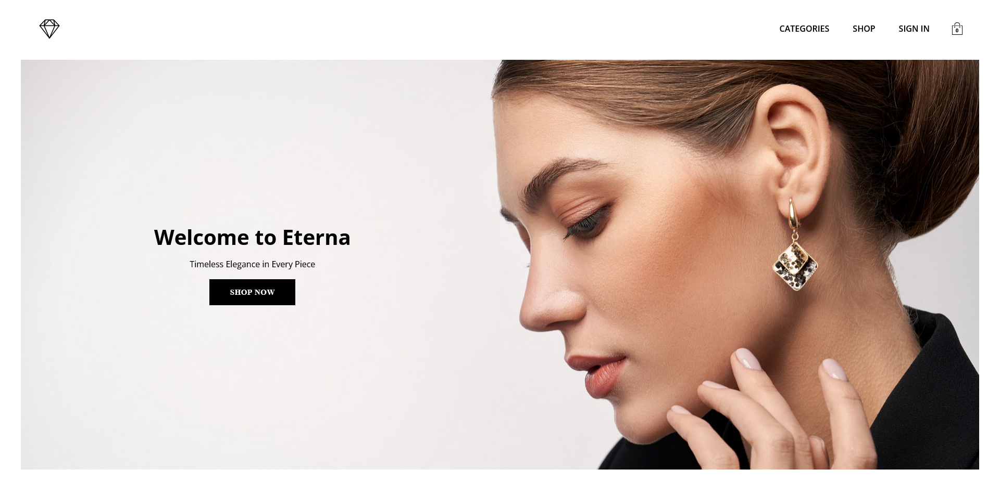

# Eterna - Elegant Jewelry E-Commerce Platform 💎

Eterna is an elegant jewelry e-commerce platform designed to provide a seamless online shopping experience. This project demonstrates full-stack development skills, utilizing React and TypeScript for the front-end and Firebase for authentication and data handling. Future iterations will transition the backend to Node.js, Express, and PostgreSQL for enhanced flexibility and scalability.

## Table of contents

- [Eterna - Elegant Jewelry E-Commerce Platform 💎](#eterna---elegant-jewelry-e-commerce-platform-)
  - [Table of contents](#table-of-contents)
  - [Overview](#overview)
    - [Screenshot](#screenshot)
    - [Links](#links)
    - [Built with](#built-with)
      - [Frontend](#frontend)
      - [Backend](#backend)
      - [Other Tools](#other-tools)
    - [How It Works](#how-it-works)
    - [What I learned](#what-i-learned)
    - [Continued development](#continued-development)
    - [Setup Instructions](#setup-instructions)
    - [Useful resources](#useful-resources)
  - [Author](#author)
  - [Acknowledgments](#acknowledgments)

## Overview

Eterna allows users to:
- Browse and filter luxury jewelry collections including rings, necklaces, earrings, bracelets, and brooches.
- Authenticate and manage their accounts using Firebase authentication.
- Add items to a shopping cart for a streamlined shopping experience.
- Explore categories via a responsive and visually engaging interface.

### Screenshot



### Links

- Frontend: [GitHub Repository](https://github.com/dantvi/eterna)
- Live Site URL: [Eterna](https://eterna.dtcode.se/)

### Built with

#### Frontend
- React & TypeScript – For a modular and scalable UI.
- SCSS – For responsive and maintainable styling.
- React Router – For seamless navigation.
- Vite – For fast and efficient development.

#### Backend
- Firebase Authentication – For secure user sign-in/sign-up.
- Firestore (temporary) – For initial product data handling (soon to be replaced with PostgreSQL).

#### Other Tools
- One.com – Hosting for the front-end.
- Cloudinary (planned) – For optimized product image storage.
- PostgreSQL (future update) – For advanced product management and user data.

### How It Works

- Shopping Experience
  - Users can browse and explore various jewelry categories.
  - Clicking a product shows detailed information.
- Authentication
  - Users can sign in with an email & password or Google Sign-In.
  - Upon authentication, their email is displayed in the navigation.
- Shopping Cart
  - Users can add and remove products from their cart.
  - The cart icon dynamically updates with the number of selected items.

### What I learned

This project allowed me to:
- Enhance my skills in React & TypeScript for type-safe, maintainable code.
- Work with Firebase Authentication for a modern user authentication system.
- Implement a shopping cart system with React state management.
- Optimize styling with SCSS for a polished UI.

### Continued development

Future updates will include:
- Migrating Firestore to Node.js & PostgreSQL for better data management.
- Adding a checkout and payment gateway for real transactions.
- Optimizing images with Cloudinary for faster loading.
- Implementing user order history and wishlists.

### Setup Instructions

1. Clone the repository: 
```bash
git clone https://github.com/dantvi/eterna.git
cd eterna
```
2. Install dependencies:
```bash
npm install
```
3. Start the development server: 
```bash
npm run dev
```

The project will now run on localhost:5173 (Vite default port).

### Useful resources

- [React Docs: Quick Start](https://react.dev/learn) - Learn React fundamentals.
- [Firebase Docs](https://firebase.google.com/docs) - Developer documentation for Firebase. 
- [SCSS Guide](https://sass-lang.com/guide/) - Advanced styling techniques.
- [Vite Documentation](https://v3.vitejs.dev/guide/) - Faster build tool for React apps.

## Author

- GitHub - [@dantvi](https://github.com/dantvi)
- LinkedIn - [@danieltving](https://www.linkedin.com/in/danieltving/)

## Acknowledgments

A big thanks to the developer community for their valuable resources. Platforms like MDN Web Docs, Stack Overflow, and various open-source contributors have provided essential guidance throughout the project.